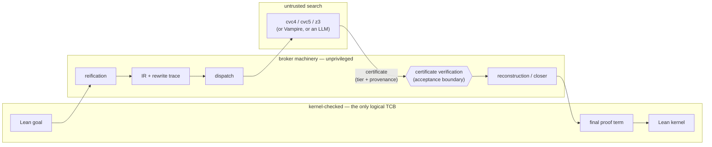

# Proof Broker

Proof Broker lets Lean 4 and Rocq use untrusted automation — SMT
solvers, a saturation prover, and language models — without trusting
it. A goal leaves the proof assistant through a shared intermediate
representation; what comes back is not a verdict but a *certificate*
with a graded trust tier. The broker verifies the certificate, and the
home kernel checks the proof term built from it. Nothing behind that
boundary joins the trusted base.

```lean
import ProofBroker

def P : Nat := 18446744069414584321

-- From VerInf's softmax-bracket spike (Bracket.lean:70).
theorem hle (Zmax : Nat) (hZ : Zmax ≤ 2^16) :
    (2:Nat)^24 + 2 * Zmax ≤ P := by
  proof_broker_term
```

cvc4 answers `unsat` in milliseconds and produces no proof. The broker
recovers a Farkas witness consistent with that verdict — the bound on
`Zmax` taken twice, the negated goal once — checks that the weighted
sum is contradictory before minting a certificate, and Lean builds the
proof term from those same coefficients. Had the solver been wrong, the
error would have stopped at the certificate check or at the kernel.

## Why

Using external search without trusting it is established practice:
Isabelle's `sledgehammer` reconstructs what external provers return,
and SMTCoq checks SMT proof witnesses in Coq. F* sits at the other
extreme and trusts its SMT encoding and solver outright. Proof Broker
generalizes the first approach into one boundary shared by several
home systems and several backends:

- **One interface.** A single IR and certificate format, so *N* home
  systems and *M* backends need *N* + *M* adapters rather than *N* × *M*
  bridges.
- **Graded evidence.** Every result records its tier: a replayable
  proof trace (Tier 3), a Farkas witness or its case-split extension
  (Tiers 1–2), or only a verdict in an integrity envelope (Tier 0). The
  tier grades the evidence, not the backend; trust in the backend is
  zero at every tier.
- **Synthesized certificates.** A backend need not speak the
  certificate language natively; the broker can recover a checkable
  certificate from a bare verdict, as in the example above.
- **Lifting.** Certificates survive the broker's own rewrites (ℕ→ℤ
  specialization, polymorphic instantiation, definition unfolding):
  refinement records carry each rewrite so the proof is lifted back to
  the original goal.

## Where trust lives



Certificate verification is the acceptance boundary: a candidate that
fails it never reaches a closer. The broker machinery itself is
deliberately outside the logical trusted base. Every closer ends in an
ordinary term the kernel checks, the FFI returns data rather than
proofs, and an axiom guard on every build refuses `sorry`-bearing
axioms and `native_decide`. A broker bug could admit a bad candidate
past the boundary, but it cannot make Lean accept a false theorem.

## Result: a real downstream consumer

On [VerInf](https://github.com/JamesPetrie/VerInf)'s softmax-bracket
spike, with its statements untouched, 19 of 19 targeted Lean
obligations close through the broker, each certificate checked before
Lean accepts the result and every theorem within Lean's standard axioms.
The certificates span the ladder: four close in term mode from Farkas
witnesses, five replay cvc5 proof traces step by step, nine close
through certificate-gated `omega`, and one rides a Tier 0 verdict,
reported as such. Integrating the unmodified file also exposed three
defects the broker's own test suite had missed. *(The count is the
demo's generated one: `tools/obligation_table.py` over the
`reference/one/` probe logs, 2026-09-05, demo commit `f208e97`.)*

Evidence and generated tables:
[proof-broker-demo](https://github.com/levineuwirth/proof-broker-demo) ·
signed release: [`r4`](https://github.com/levineuwirth/proof-broker/releases/tag/r4) ·
write-up: [Separating Proof Search from Trust](https://levineuwirth.org/essays/proof-broker/).

## Current work

Language models as certificate proposers. Rather than asking a model
for a proof, the broker asks it for a certificate — so far, a Farkas
witness over named arithmetic rows — which is verified before any proof
is built and then consumed by a fixed reconstruction tactic. The
evaluation treats certificate validity, consumption, and kernel
acceptance as separate outcomes, fixes its population before any run is
read, and asks what a learned proposal adds beyond deterministic search.

## Project status

This repository implements the Proof Brokerage Architecture spec v1.0
as amended by the v1.1 delta (`delta.md §7`; TeX sources in `spec/`).
The R-series roadmap v1.1 (`spec/roadmap-v1.1.md`) supersedes the v1.0
phase sequence; `delta.md` records post-spec engineering decisions
(notably the OCaml language flip) and the per-phase decision records.

What ships is a sound, gated, multi-backend **certificate-gated
re-proving** system: goals from Lean 4 and Rocq are reified into the
IR, dispatched to cvc4 / cvc5 / z3 (SMT), Vampire (ATP) or an LLM
endpoint, and the returned certificate is verified by the OCaml SDK
(envelope, Farkas witnesses, per-step Alethe replay, TSTP provenance)
before a home-system closer re-derives the goal — term-mode Farkas
reconstruction for Tier 1/2, the per-rule Alethe walker for cvc5
Tier-3 traces on both bridges, `omega` / `lia` / `linarith` / `aesop`
/ `hauto` otherwise. Every closure path is policed by the CI trust
gate (`tools/check_axioms.py` against `tools/axiom_allowlist.json`):
no `sorry`, no admits, no new axioms. The spec's central
architecture — metadata-bearing IR, the rewrite pipeline with traces
inside every dispatch, refinement records with real embedding
witnesses, and **lifting** the proof back through them — is live as
of R2–R3: the ℕ→ℤ specialization (both bridges), the polymorphic-α
replay of Farkas certificates and the def-unfold inversion in the
lifted term (Lean; the Rocq ports of the latter two and of the R4
reifier shapes are recorded deferrals — the generated row below lists
them). `delta.md` records every decision that diverges from the spec;
`delta.md §7` is the consolidated v1.1 delta, including what v1.0
promised and v1.1 demotes (Tier 0 as a trust expansion, the Tier 2
lemma list, TSTP replay) and why. The trust structure of this
paragraph — untrusted search, unprivileged broker machinery,
kernel-checked closure — is drawn as a single figure in the demo's
[where trust lives](https://github.com/levineuwirth/proof-broker-demo#where-trust-lives).

The Alethe walker is the spec's native symbolic checker for cvc5's
`alethe-2024` traces and the largest single body of work in the tree:
built rule by rule on Lean and mirrored on Rocq in May 2026, then made
a gated artifact in June — a rule-parity check across both walkers and
the SDK mint gate, a replay corpus with a static coverage gate and a
generated kernel-checked replay theory, a blocking live-drift gate
against the pinned cvc5, a scale profile, and a fuzzer for the
resolution algebra. Its production path (the SDK mint gate equal to
the walkers' rule set, UF/UFLIA routed to it, live-strict corpus
suites on both bridges) was closed in R1. Its trust shape is a hybrid,
stated as such: the proof skeleton is kernel-constructed step by step,
while the arithmetic leaf rules (`la_generic`, `la_mult_neg`, `hole`,
`rare_rewrite`) are re-decided by `omega`/`lia` — less faithful at the leaves than Tier 1 term mode, where the
certificate's coefficients flow into the term (`delta.md §7.7`,
`RETROSPECTIVES/phase-6-scale.md`, `corpus/README.md`).

The table and the note under it are generated by `python3
tools/status_table.py` from the committed JSON / source files it names
(`--check` in the schemas CI job fails if this copy drifts; `--write`
refreshes it). It is the only place this README states a count of
this repository's own surfaces; the downstream result above carries the
demo repository's generated count, with its provenance and date
inline.

<!-- status-table:begin (generated by tools/status_table.py; do not edit by hand) -->
| surface | value | source |
|---|---|---|
| Trust gate (Lean) | 190 allowlisted theorems; 3 distinct axioms: `Classical.choice`, `Quot.sound`, `propext` | `tools/axiom_allowlist.json` (gated by `check_axioms.py` in the lean-bridge job) |
| Trust gate (Rocq) | 182 allowlisted theorems; 4 distinct axioms: `ClassicalDedekindReals.sig_forall_dec`, `FunctionalExtensionality.functional_extensionality_dep`, `classic`, `propositional_extensionality` | `tools/axiom_allowlist.json` (gated by `check_axioms.py` in the rocq-bridge job) |
| Alethe walker rules | Lean 31, Rocq 31 (at parity) | dispatch arms between `PARITY:walker-rules` markers (`check_walker_parity.py`) |
| Walker corpus | 24 goals, 1541 proof steps; statically walkable 24/24; in the generated `CorpusReplay.v` 17/24 (the coqc ground truth for those is that file compiling in the rocq-bridge job) + 7/24 live-strict only (`CorpusWalkerLive_*` on both bridges — their coqc/kernel ground truth; the static replay has no ℕ→ℤ cast layer); live-mintable 24/24 | `corpus/index.json`, `corpus/coverage.json` (`check_walker_coverage.py --check`, `gen_corpus_replay.py --check`) |
| Rocq lifting deferrals | `R3-M2` (delta §5.5); `R3-M3` (delta §5.6); `R4` (delta §5.7) | `delta.md` decision records carrying `**Rocq port: DEFERRED**` |
| Backends (adapter manifests) | cvc4 1.8 (tiers 0,1); cvc5 1.3.0 (tiers 0,1,2,3; alethe-2024); llm 0 (tiers 3; lean-tactic-script); vampire 5.1.0 (tiers 0,3; tstp-fof,tstp-thf); z3 4.16.0 (tiers 0,1) | `examples/manifest-*.json` |
| Toolchain pins | Lean `leanprover/lean4:v4.32.0`; OCaml `5.4`; dune `>= 3.21 & < 3.24`; rocq-runtime `>= 9.0 & < 9.2`; cvc5 `1.3.0`; Vampire `v5.1.0`; elan `v4.2.4` | `lean-bridge/lean-toolchain`, `proof_broker_rocq.opam`, `validate.yml` env pins |
| CI jobs (timeout) | schemas (10 min); sdk (20 min); sdk-cross-platform (20 min); lean-bridge (40 min); rocq-bridge (30 min); ci-status (5 min); weekly cron `17 6 * * 1` | `.github/workflows/validate.yml` |
| Retrospectives | `phase-0.md`, `phase-1-3-lean.md`, `phase-3-rocq-parity.md`, `phase-4.md`, `phase-5.md`, `phase-6-scale.md` | `RETROSPECTIVES/` |

Version labels: the *Backends* row is each adapter's **declared** `adapter_version` from `examples/manifest-*.json` (the label it stamps into certificates); the *Toolchain pins* row is the binary CI actually installs (`validate.yml` env pins). Every backend with a CI pin declares the pinned version.
<!-- status-table:end -->

### Phase map

Work is tracked as an R-series of gated phases (each ends at a
reviewed checkpoint; a phase is DONE only when its own gate passed).
The roadmap's original Phase 0–6 numbering is kept for the history in
`delta.md §2` and `RETROSPECTIVES/`:

| R-phase | goal | old phases it absorbs |
|---|---|---|
| R0 | re-green CI, local parity, repo hygiene, script-derived status (this table) | — |
| R1 | close the walker's production path (SDK mint gate = walker rule set; UF/UFLIA routed to the walker; live-strict corpus suite on both bridges) | Phase 2.6 (replayer), "Phase 6" as used by `phase-6-scale.md` (walker scale) |
| R2 | make the certificate load-bearing: rewriter on the live path, real `rewrite_trace_hash`, honest envelope, identity-trace guard | Phase 2.4/2.5 (passes, trace) |
| R3 | specialization + lifting: ℕ→ℤ, polymorphic α, definitional unfolding inverted in the lifted term | Phase 2.1–2.3, 2.7 (metadata, lifting) |
| R4 | external demo: `by proof_broker` on a downstream Lake project's ℕ/ℤ LIA and UFLIA obligations | Phase 3 exit criterion applied externally |
| R5 | spec v1.1 delta, roadmap v1.1, docs consolidation | Phase 1 → v1.1 checkpoint (never written), Phase 5/6 double meaning resolved |
| shipped | Phases 0 (foundations), 1 (skeleton), 2.8 (capability matching), 3 (breadth: Vampire and the LLM adapter + replay closer on both bridges; concurrent dispatch on Lean only — the Rocq bridge dispatches sequentially through `Dispatch.run`, decide-list), 4 (Rocq probe: the shell calculus survived a second home system; the metadata half of the IR was never probed — R3), 5 (term-mode parity), 6 (cross-platform CI matrix + signing scaffold) | see `delta.md §2`, `RETROSPECTIVES/` |

## Layout

- `spec/` — specification, refcard, roadmap (TeX sources)
- `schemas/v1.0/` — JSON Schemas for IR, certificate, refinement
  record, adapter manifest, rewrite trace
- `registry/` — versioned patterns registry (logic features,
  fragments, theory tags, axiom shapes, concept tags, construction
  kinds)
- `examples/` — hand-written reference IR documents for the spec §12
  worked examples; canonical fixtures for downstream components
- `sdk/` — OCaml shared library: IR rewriter, certificate verifier
  (envelope, Farkas, per-step Alethe re-check = the Tier-3 mint gate,
  TSTP provenance), dispatcher (Thread-based concurrent driver),
  cvc4 / cvc5 / z3 / Vampire / LLM adapters, `corpus_gen`, and the
  FFI shim (`sdk/ffi/`) used by Lean; `sdk/FFI_CONVENTIONS.md`
- `lean-bridge/` — Lean 4 plugin: reifier (`Int` LIA, BitVec, the
  higher-order/FOL fragment), the `proof_broker` / `proof_broker_term`
  / `proof_broker_walker` tactics, the Alethe walker
  (`ProofBroker/Alethe.lean`), the LLM-script replay closer, and the
  optional `ProofBrokerMathlib` opt-in (LRA `linarith` closer + the HO
  `aesop` closer for the Vampire path)
- `rocq-bridge/` — Rocq plugin: direct-link to the OCaml SDK, the same
  tactic family (`proof_broker`, `proof_broker_term`,
  `proof_broker_walker`, `proof_broker_verbose`), the Alethe walker
  (`src/alethe_walker.ml`), generated `theories/CorpusReplay.v`, and the
  opt-in `hammer/` package (`hauto` HOL closer)
- `corpus/` — walker replay corpus: hand-authored goals, `corpus_gen`
  traces from pinned cvc5, committed coverage / profile baselines
- `tests/` — cross-canonical hash fixtures shared by the OCaml and
  Python canonicalizers
- `tools/` — Python validators, schema cross-checks, axiom-trust gate,
  walker parity / coverage / replay-gen / profile gates, resolution
  fuzzer, and `status_table.py` (this README's numbers)
- `RETROSPECTIVES/` — phase-by-phase post-mortems (list in the table)
